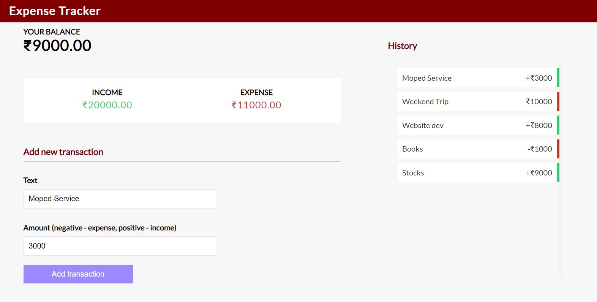

# Social Plus
<!-- ABOUT THE PROJECT -->
## About The Project
The application is used to track and store expenses. This application build using MERN stack
### Built With MERN
* [MongoDB](https://www.mongodb.com/) - Database
* [Express JS](https://expressjs.com/) - Creating Rest End Point
* [React JS](https://reactjs.org/) - Front End
* [Node JS](https://nodejs.org/en/) - Back End 

<br>
<hr>

<!-- GETTING STARTED -->
## Getting Started
### Prerequisites
1. MongoDB
2. Node JS
3. NPM
3. React JS

### Database
1. Collections - 
    - *transaction* - use to store transaction related information
2. Fields - 
    - *transaction* - _id, text, amount, createdAt

### Server - steps to start server side
1. run command ** npm install** to install required modules
2. add **config.env** file in ``` \server\config ``` dir and provide **MONGO_URI** for db connection.
```
MONGO_URI=mongodb://<HOST_NAME>:<PORT>/<DATABASE_NAME>
```
3. to start server use command **npm start**


*I have also attached POSTMAN collection for rest endpoint reference*

### Client - steps to start client side
1. run command ** npm install** to install required modules
2. to start server use command **npm start**

### Frontend Screenshots
